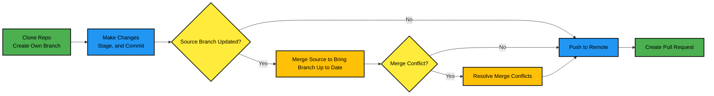

<!--
---
marp: true
theme: default
paginate: true

style: |
  section.follow-along {
    background: linear-gradient(135deg, #e0ffe0 0%, #b2f7b8 100%);
  }
  footer {
    color: #218c3a !important;
    font-weight: bold;
  }

---
-->

# Git Hands-On Training

**Version Control with Git**
🛠️ Practical Commands | 🤝 Collaboration | 🧠 Troubleshooting

---

## Session Goals

- Understand Git basics and daily workflows
- Practice staging, committing, branching, and merging
- Resolve merge conflicts with confidence
- Learn how to explore Git help and documentation

---

## Introduction to Git

**What is it?**
- Distributed version control system
- Tracks changes in source code
- Enables collaboration

**Why use it?**
- Code history
- Branching for features
- Easy collaboration and rollback

<!-- Popular platforms: GitHub, GitLab, Bitbucket -->

---

## Key Concepts



- **Repository**: Project folder with `.git` directory
- **Branch**: Parallel line of development
- **Remote**: Git repo hosted online (e.g., GitHub)
- **Staging**: 
- **Commit**: Snapshot of changes
- **Merge**: Combine changes from one branch into another

---

## Git Setup

```bash
git config --global user.name "Your Name"
git config --global user.email "you@example.com"
```
Initializes identity for commits. Remove `--global` to set identity for current repo only.


```bash
git init  # Create a new repo
git clone <url>  # Clone an existing repo
```

---
<!-- _class: follow-along -->
<!-- _footer: 🟢 Follow Along -->


## Cloning the Repository

Clone the training repository
```bash
git clone https://github.com/Nayak-A/git-training-repo.git
```
Navigate to the clone repo and opens the directory in VS Code

```bash
cd git-training-repo
code . 
```

---

## Branching

```bash
git branch
```
```bash
git switch <branch>
```
```bash
git switch -c <branch>
```
```bash
git merge <branch>
```

🌿 Use branches to develop features independently

---
<!-- _class: follow-along -->
<!-- _footer: 🟢 Follow Along -->

## Your Personal Branch

Create a branch to make changes in
```bash
git checkout -b your-branch-name
```

---

## Remote Collaboration

```bash
git remote -v
```
```bash
git fetch
git pull
```
```bash
git push
```

🌍 Work with centralized repos (e.g., GitHub)

---
<!-- _class: follow-along -->
<!-- _footer: 🟢 Follow Along -->

## Publish Your Branch

Push your branch to remote
```bash
git push origin your-branch-name
```
Git is very helpful when we go wrong, try adding `-u` or `--set-upstream` after `push`
```bash
git push --set-upstream origin your-branch-name
```

---

## Basic Workflow

1. Modify a file
2. Stage the change
3. Commit with a message
4. Push to remote

```bash
git status 
git add <filename>
git commit -m "Describe your change"
git push
```

---
<!-- _class: follow-along -->
<!-- _footer: 🟢 Follow Along -->

## Stage, Commit, and Push Changes

Open `src.txt` and add a line to the end, or simply run
```bash
echo Random %RANDOM% %DATE% %TIME% >> src.txt
```
Next, we'll stage our changes
```bash
git status 
git add src.txt
```
<!-- It's always a good practice to check the status of your local repo before staging/commiting -->
<!-- show example of staged v/s unstaged chanegs -->

Finally, we commit our changes and push them to the remote repository
```bash
git commit -m "Updated src.txt"
git push
```
We don't need to specify remote or which branch, since we are already tracking

---

## Merging Branches

```bash
git switch main
git pull
git merge your-branch-name
```

➡️ If there are no conflicts, it merges cleanly
➡️ Otherwise, you'll resolve conflicts

---

## Merge Conflict Example

```bash
<<<<<<< HEAD
This is the main branch.
=======
This is your branch.
>>>>>>> your-branch-name
```

✅ Keep what you want\
✅ Delete conflict markers\
✅ Then:

```bash
git add <filename>
git commit
```

---

## Stashing

Save current changes for later
```bash
git stash
```
Restore saved changes LIFO order
```bash
git stash pop
```

🧳 Save temporary changes without committing

---

## Undoing Mistakes

```bash
git restore <file>
git reset --soft HEAD~1
git reset --hard HEAD~1
git revert <commit>
git reflog
```

🧹 Undo changes safely

---

## How to Find a Git Command
- Official Git documentation: [git-scm.com/docs](https://git-scm.com/docs)
- Use the Git CLI for help:
   ```bash
   git help <command>
   git <command> --help
   ```
   This opens a locally saved version of the documentation.
- On Linux, you can also use:
   ```bash
   `tldr git <command>`
   ```
- For Windows users, try [tldr.sh](https://tldr.sh/) or simply search via ChatGPT or Google.

💡 Tip: Practice self-research and experimentation

---

## Final Challenge

✅ Create a new branch\
✅ Make a change\
✅ Merge back to `main` (resolve any conflict!)

---

## Thanks & Resources

- [Pro Git Book](https://git-scm.com/book)
- [Git Cheat Sheet](https://education.github.com/git-cheat-sheet-education.pdf)
- [GitHub Docs](https://docs.github.com)
- [tldr.sh](https://tldr.sh)
- [Oh My Git! Game](https://ohmygit.org/)

🙋 Final Q&A
---
